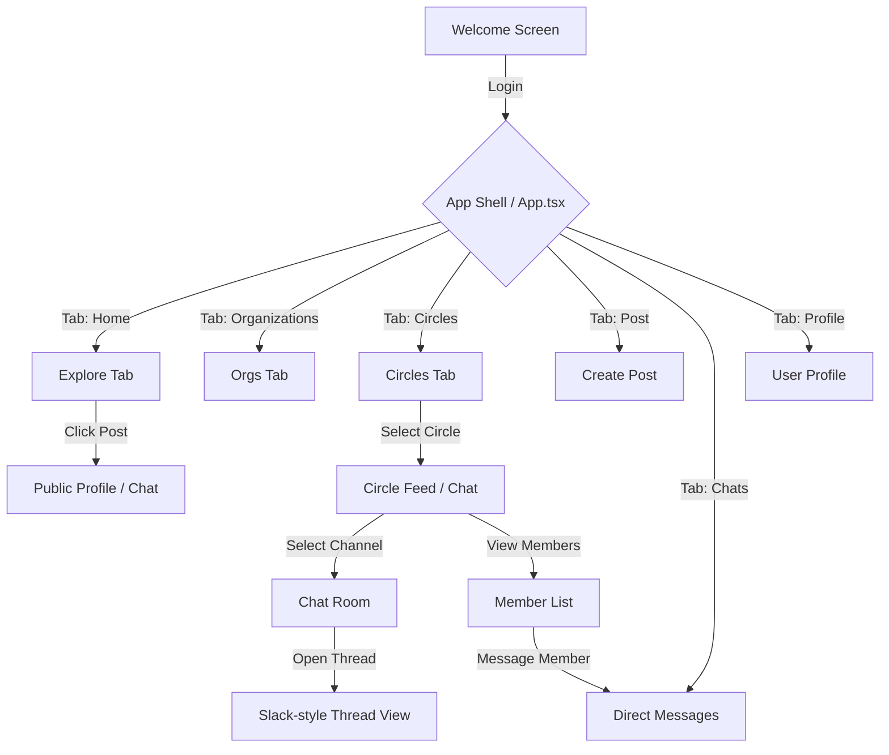

# Kula App: User Flow & Architecture

This document outlines the user flow and component architecture of the Kula neighborhood app.

## 1. High-Level Navigation Flow

---

## 2. Detailed Interaction Walkthrough

### 2.1 Onboarding
- **Component**: `src/components/Welcome.tsx`
- **Logic**: If `user` is null (monitored by `useAuth` hook), the app displays the Welcome screen.
- **Goal**: Authenticative via Google. Once logged in, `App.tsx` re-renders and shows the `AppContent`.

### 2.2 Home / Explore
- **Component**: `src/components/Explore.tsx`
- **Flow**:
    1. Fetches geolocation via `useGeolocation`.
    2. Lists nearby "Needs" (asks) and "Shares" (gives).
    3. Clicking an item navigates to the owner's profile or initiates a chat.

### 2.3 Community Circles (The Communication Hub)
- **Component**: `src/components/Circles.tsx`
- **The Core Interaction**:
    - **Feed View**: See updates filtered by your circle.
    - **Member List**: Access a directory of neighbors in the circle. You can initiate a **Direct Message** from here.
    - **Chat View**: Lists "Channels" (e.g., #General, #UrgentNeeds).
    - **Chat Room (`src/components/ChatRoom.tsx`)**:
        - **Main Chat**: A real-time stream of messages.
        - **Common Circles Highlight**: In 1-on-1 chats, the app displays shared circles between users to establish trust and context.
        - **Urgent SOS**: Messages sent in `#UrgentNeeds` are flagged as SOS.
        - **Polled Questions**: Community voting.
    - **Slack-style Threads**:
        - Users can click the "Message Square" icon on any message to open a **Thread**.
        - This sets `activeThread` in state.
        - The view shifts to focus *only* on that message and its specific replies (stored in a sub-collection `/replies` in Firestore).

### 2.4 Posting Flow
- **Component**: `src/components/PostItem.tsx`
- **Flow**:
    - Select Type: **SHARE** (Giving away) or **ASK** (Asking for a need).
    - Add context: Title, Description, Category.
    - Result: Created items appear on the map (`MapView.tsx`) and in the `Explore` feed.

---

## 3. Technical Data Flow (Firestore)

| Collection | Description | Relational Connection |
| :--- | :--- | :--- |
| `users` | User profiles and preferences | Linked via `uid` |
| `items` | Posts for needs/shares | Linked to `senderId` |
| `circles` | Community groups | Parent of `chats` |
| `chats` | Channels/Threads | Grouping for `messages` |
| `messages` | Chat entries | Child of `chats` |
| `replies` | Threaded replies | Sub-collection of a specific `message` |

---

## 4. Why this matters
By modularizing the UI into `App.tsx` as a switcher and `Circles.tsx` as a scoped community view, the app remains scalable. The transition to **Slack-style threads** ensures that high-volume channels don't get cluttered, allowing "focused conversations" to happen in isolation.
