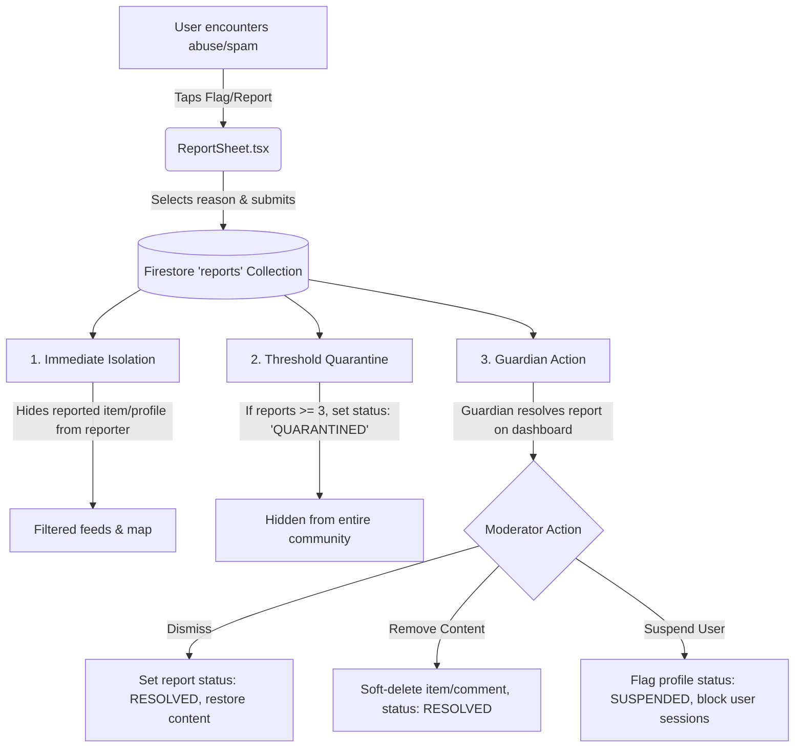

# KULA Moderation & Report Architecture

This document describes the lifecycle of reported content (items, profiles, comments) in KULA. It maps out how reports are created, how the client handles reported content immediately to protect user safety, and how community **Guardians** review and resolve flags.

---

## 🔄 The Report Lifecycle Flow



---

## 1. Immediate Isolation (Reporter Experience)
To ensure the reporter is safe immediately:
* **Hiding Reported Items**: When a user reports an item, the item ID is appended to a `reportedItems` array on their user profile document. The discovery feeds ([useItems.ts](file:///Users/serdar/ANTIGRAVITY/KULA/src/hooks/useItems.ts)) filter out any items present in `reportedItems` (similar to how `blockedUsers` are excluded).
* **Hiding Reported Profiles**: When a user reports a neighbor's profile, the app asks if they also want to block them. If accepted, the target UID is appended to the user's `blockedUsers` list, immediately hiding their posts, map pins, and chats.

---

## 2. Threshold Quarantine (Community Auto-Moderation)
Before a Guardian can review a report, the community requires automated shielding:
* **Report Count Threshold**: Each report written to `reports` triggers a Firestore transaction that increments a `reportCount` counter on the targeted item (or user profile) document.
* **Auto-Quarantine**: If `reportCount >= 3` (configurable), the item's `status` changes from `'ACTIVE'` to `'QUARANTINED'`.
* **Feed Filters**: Feed queries explicitly filter out `'QUARANTINED'` items, preventing objectionable content from spreading globally while awaiting review.

---

## 3. Guardian Review Dashboard (Human Moderation)
KULA's design features **Guardians** (local community leaders/moderators). We can expand the [GuardianDashboard.tsx](file:///Users/serdar/ANTIGRAVITY/KULA/src/components/GuardianDashboard.tsx) from a developer bypass status log into a real moderation dashboard:

### 📋 The Moderation Queue UI
If a logged-in user is verified as an admin/guardian (`profile.isAdmin === true`), they will see a **Moderation Queue** tab displaying pending reports:

1. **Inbox List**: Queries `reports WHERE status == 'PENDING' ORDER BY createdAt ASC`.
2. **Item Details**: Displays:
   * Reported item details (text, images, owner).
   * Reporter name, selected reason (e.g. Scam, Harassment), and extra details.
3. **Action Triggers**:
   * **`Dismiss Report`**: Updates the report status to `'RESOLVED'` without altering the content.
   * **`Remove Content`**: Updates the reported item's status to `'DELETED_BY_MODERATOR'`, logs the moderator ID, and updates the report status to `'RESOLVED'`.
   * **`Suspend User`**: Soft-deletes all items owned by the reported user, updates their user profile `hostStatus` or adds `isSuspended: true`, and logs out their active native sessions.

---

## 💾 Schema Modifications Checklist

### 1. `users` Collection
To track blocks and reports per-user:
```typescript
interface UserProfile {
  uid: string;
  // ... existing fields
  blockedUsers?: string[];       // UIDs of blocked users
  reportedItems?: string[];      // IDs of items flagged by this user
  reportedUsers?: string[];      // UIDs of users flagged by this user
  isSuspended?: boolean;         // Set true to disable access during ban
}
```

### 2. `items` Collection
To support item-level flagging and states:
```typescript
interface Item {
  id: string;
  // ... existing fields
  reportCount?: number;          // Total flags received
  status: 'ACTIVE' | 'MATCHED' | 'COMPLETED' | 'QUARANTINED' | 'DELETED_BY_MODERATOR';
}
```

### 3. `reports` Collection
```typescript
interface ContentReport {
  id: string;
  reporterId: string;
  reporterName: string;
  type: 'USER' | 'ITEM' | 'COMMENT';
  targetId: string;
  targetName: string;
  reason: 'Spam' | 'Harassment' | 'Hate speech' | 'Offensive' | 'Scam' | 'Other';
  details?: string;
  status: 'PENDING' | 'RESOLVED' | 'DISMISSED';
  createdAt: FieldValue;
  resolvedBy?: string;           // Guardian UID who acted
  resolvedAt?: FieldValue;
}
```
