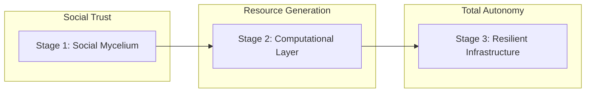
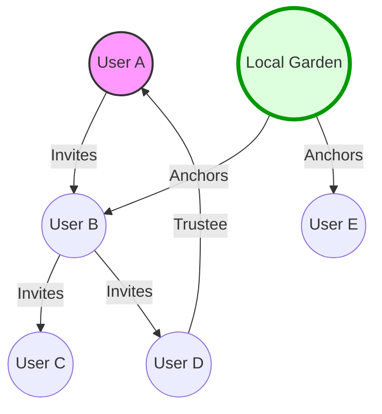

# KULA: An Ode to Collective Existence
**A Whitepaper for a Resilient Neighborhood Infrastructure**

## Table of Contents
1. [The Philosophy: Beyond the Closed Loop](#1-the-philosophy-beyond-the-closed-loop)
2. [The Roadmap: Three Horizons of Evolution](#2-the-roadmap-three-horizons-of-evolution)
3. [Stage 1: The Social Mycelium (Trust & Gifting)](#3-stage-1-the-social-mycelium-trust--gifting)
4. [Stage 2: The Computational Layer (Digital Imece)](#4-stage-2-the-computational-layer-digital-imece)
5. [Stage 3: The Resilient Infrastructure (Mesh & Sovereignty)](#5-stage-3-the-resilient-infrastructure-mesh--sovereignty)
6. [Conclusion: The Decoupled Society](#6-conclusion-the-decoupled-society)

---

## 1. The Philosophy: Beyond the Closed Loop
The dominant cultural narrative of our time is one of **Closed-Loop Socioeconomic Interactions**. This narrative suggests that every exchange must be a clearly defined transaction: "I give you X, and you give me Y." This mindset has turned our neighbors into strangers and our communities into marketplaces.

KULA is a challenge to this narrative. We argue that this transactional loop is suffocating our communities. Historically and traditionally, human existence has never been a series of closed loops. We help those who can never help us back, and we receive help from those we have never met. This is the **Ode to Collective Existence**—a recognition that our interdependence can never be fully understood or quantified by discrete transactions.

---

## 2. The Roadmap: Three Horizons of Evolution
KULA is not a static product but an evolving organism. Our roadmap is structured into three distinct horizons:

*   **Stage 1 (Horizon 1):** Building the Social Mycelium through a trust-based gift economy.
*   **Stage 2 (Horizon 2):** Launching the Computational Layer (Eco-Compute) to create a Community Treasury.
*   **Stage 3 (Horizon 3):** Transitioning to a fully Resilient Infrastructure (Mesh Networking & P2P Sovereignty).

---

## 3. Stage 1: The Social Mycelium (Trust & Gifting)
The "Problem of the Intermediary" is the primary barrier to sharing. KULA solves this by making the existing "Invisible Threads" of a neighborhood visible.

### 3.1 The KULA Mycelium (Visualizing Indirect Bonds)
We often feel like strangers, yet we are connected by a vast, invisible network. KULA maps these **Indirect Bonds**, showing you how a neighbor is connected to you through mutual friends or organizations.

### 3.2 The Mechanics of Trust
*   **Invitation Lineage:** Every member enters through an invitation, creating a "Lineage Tree" that maps the community's growth.
*   **Trustee Requests:** Neighbors formally "vouch" for each other, strengthening the bonds between disparate branches of the Mycelium.
*   **Circles & Organizations:** Localized cells and community "Anchor Nodes" (like bookstores or gardens) stabilize the network.

---

## 4. Stage 2: The Computational Layer (Digital Imece)
KULA transforms community trust into a self-sustaining utility by utilizing the idle power of smartphones.

### 4.1 Eco-Compute & The Community Treasury
Users "donate" their phone's NPU power while charging (Digital Imece). The revenue generated from AI inference is split:
*   **60% to the User** (KULA Credits).
*   **20% to the Neighborhood Fund** (Democratically managed).
*   **20% to Infrastructure** (Orchestration costs).

### 4.2 Hardware Safety: The Nightstand Test
Computation only begins if the "Sensor Fusion" conditions are met: Charging, Stationary, Thermal Headroom (<35°C), and Unobstructed (Not under a pillow). A "Thermal Governor" ensures device health is never compromised.

---

## 5. Stage 3: The Resilient Infrastructure (Mesh & Sovereignty)
The final evolution is a network that can survive without the internet.

### 5.1 The Physical Mesh
The "Social Mycelium" becomes a literal **Physical Mycelium**. Devices "hop" data across the neighborhood via Bluetooth and Wi-Fi Direct. Using **Store-and-Forward** logic, messages "hitch a ride" on moving devices, ensuring connectivity even during total outages.

### 5.2 Local-First Sovereignty
By moving to a P2P architecture (RxDB/GunDB) and CRDTs, data belongs to the phones. The central cloud intermediary is removed. The neighborhood becomes a **Socioeconomic Mesh**—self-healing, self-funding, and fundamentally resilient.

---

## 6. Conclusion: The Decoupled Society
KULA is a journey toward neighborhood sovereignty. By starting with trust and building toward resilience, we create a blueprint for a future where technology serves the community, not the other way around. It is an infrastructure for a collective existence that can no longer be switched off.
