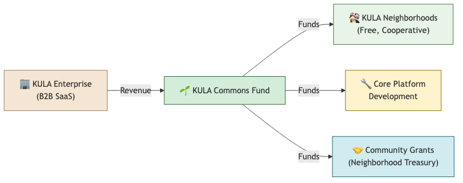
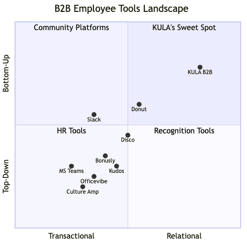

# KULA B2B: Intra-Organizational Gift Economy

*What happens when the neighborhood becomes the workplace?*

---

## The Premise

KULA's core primitives — **ASK**, **SHARE**, **JOIN**, **İMECE**, **Circles**, and the **Trust Mosaic** — were designed for neighborhoods. But there's a structural parallel that's hard to ignore: **large organizations are neighborhoods**. Departments are blocks. Teams are Circles. The cafeteria is the Kiez. And the same "Problem of the Intermediary" that makes it awkward to ask your physical neighbor for a drill makes it awkward to ask someone three floors up if they have a spare HDMI adapter, know how to fix a Docker compose issue, or want to join a lunchtime running group.

The question is whether KULA's soul survives the translation — or whether "B2B" is just another word for "we sold out to the transaction."

---

## The Product Vision: What B2B KULA Looks Like

### How the Primitives Translate

| KULA Primitive | Neighborhood Context | Organizational Context |
|---|---|---|
| **ASK** | "Anyone have a drill I can borrow this weekend?" | "Does anyone have experience with Kubernetes RBAC? Stuck on a config." |
| **SHARE** | "Giving away a couch, moving next week" | "I have 2 extra conference tickets for next Thursday" / "Sharing my Figma component library" |
| **JOIN** | "Neighborhood cleanup on Saturday, need 10 people" | "Lunchtime yoga in the courtyard, all welcome" / "Volunteering at the food bank, company-sponsored" |
| **İMECE** | "Help me paint my apartment, I'll cook for everyone" | "Hackathon: 48 hours to build an internal tool, pizza provided" / "Cross-team sprint to clear the tech debt backlog" |
| **Circles** | Kiez groups, book clubs, parents of the block | Engineering guild, DEI committee, Berlin office social, new-hire cohort 2026-Q2 |
| **Lookout** | "Alert me if anyone shares a bicycle" | "Alert me if anyone shares Python data-science expertise" |
| **Trust Mosaic** | Completed exchanges, İmece participations, vouch count | Mentoring sessions given, cross-team collaborations, peer endorsements |
| **Invitation Lineage** | Who invited you to the neighborhood network | Who onboarded you / your team lead / your buddy |
| **GratitudeFlow** | Thank-you notes after exchanges | Peer recognition — "Thanks for helping me debug at midnight before the launch" |

### A Day in the Life: KULA at "Helios GmbH" (500 employees)

> **9:15** — Elif from Product Design posts an **ASK**: *"Anyone know how to set up Lottie animations in React Native? Our contractor left and the docs are thin."*
>
> **9:22** — Jonas from Backend Engineering sees it via his **Lookout** rule for "React Native". He swipes right. They connect in a KULA chat. 20 minutes later, Elif has working animations.
>
> **10:00** — The #sustainability Circle posts a **JOIN**: *"Rooftop garden planting session this Friday, 12–14h. We have soil and seedlings. Bring gloves."* 11 people join.
>
> **14:30** — HR shares a **SHARE**: *"3 remaining spots for the leadership coaching workshop next month. First come, first served — no manager approval needed."*
>
> **16:00** — The Platform team launches an **İMECE**: *"We need 5 engineers from different teams for a 2-day observability sprint. Goal: unified logging across all services. Coffee and recognition guaranteed."*
>
> **17:00** — Elif sends Jonas a **Gratitude Note**: *"You saved my sprint. The Lottie thing would have taken me a full day to figure out alone."* Jonas's Trust Mosaic grows.

This isn't Slack. It's not Jira. It's not a corporate intranet. It's the **informal connective tissue** that makes large organizations feel smaller.

---

## Opportunity–Challenge Matrix

### 🔧 Technical Dimension

| | Opportunities | Challenges |
|---|---|---|
| **Multi-Tenancy** | Each organization is a "neighborhood" — a clean isolation model. KULA's `Circle` and `reachTypes` already scope visibility. | Firebase's security rules need per-tenant isolation. Row-level security, tenant-aware queries, data residency per org. Significant backend rework. |
| **SSO / Identity** | Replace anonymous Firebase Auth with SAML/OIDC. The `hostId` invite chain becomes the org chart. Automatic trust bootstrapping — everyone in the org starts with a baseline trust. | Lose the "stranger → neighbor" trust arc that makes KULA's trust model meaningful. If everyone is pre-trusted, what does the Trust Mosaic even measure? |
| **Admin & Analytics** | New `GuardianDashboard` per org: engagement metrics, top contributors, most active Circles, cross-team collaboration heatmaps. | Surveillance risk. The moment you give managers a dashboard showing who asks for help the most, you've weaponized vulnerability. |
| **Integration Layer** | Connect to Slack (notifications), Google Calendar (JOIN events), HR systems (team/department as Circles). | KULA's value is being *outside* the productivity stack. If it becomes another Slack channel, it loses its soul. |
| **Moderation & Compliance** | Enterprise moderation tools, content policies, audit trails. Circles can be mapped to compliance boundaries. | Gift economies depend on informality. The moment legal needs to approve every SHARE post, the warmth dies. |
| **Existing Architecture** | The `Item`, `Circle`, `Chat`, `UserProfile` data model is already 80% ready for B2B. `reachTypes` (VICINITY → DEPARTMENT, ALL_CIRCLES → ALL_COMPANY, SPECIFIC_CIRCLES → SPECIFIC_TEAMS) maps cleanly. | The mobile-first, `max-w-md` single-column layout doesn't work for desktop enterprise. Needs a full responsive redesign. |

#### What Changes in `types.ts`

```typescript
// B2B Extensions
export interface Organization {
  id: string;                          // Tenant ID
  name: string;
  domain: string;                      // SSO domain
  plan: 'STARTER' | 'TEAM' | 'ENTERPRISE';
  settings: {
    allowAnonymousAsks: boolean;       // Can people ask without showing their name?
    requireManagerApproval: boolean;    // For İMECE that pulls people from their team
    enableGratitudePublicFeed: boolean; // Show gratitude notes org-wide?
    maxCircleSize: number;
    dataRetentionDays: number;
  };
  createdAt: any;
}

// UserProfile additions
export interface B2BUserProfile extends UserProfile {
  organizationId: string;              // Tenant isolation
  department: string;                  // Maps to auto-generated Circle
  role: string;                        // Job title (optional, for context in ASKs)
  managerId?: string;                  // For İMECE approval flows
  ssoId: string;                       // External identity provider ID
}
```

---

### 💰 Economic Dimension

| | Opportunities | Challenges |
|---|---|---|
| **Revenue Model** | SaaS subscription per org: €5–15/user/month. No ads, no data selling — aligned with KULA's anti-extraction ethos. Organizations *pay for the infrastructure*, not for the data. | Pricing pressure from free tools (Slack, Teams, Donut). "Why pay for another tool when Slack has channels?" |
| **Market Size** | Internal knowledge sharing, peer mentoring, employee engagement — a market worth €14B+ globally (Gartner 2025). Companies spend €300–500/employee/year on engagement tools. | Crowded market: Donut, Disco, Bonusly, Kudos, Culture Amp. KULA's differentiator is the *gift economy philosophy*, but can HR buyers understand that? |
| **Cost of Disengagement** | Gallup: disengaged employees cost organizations 18% of annual salary. A 500-person company with 50% engagement loses ~€2.7M/year. KULA targets the *informal fabric* that drives engagement. | Hard to prove ROI. "How do you measure the value of Jonas helping Elif with Lottie animations?" Gift economies resist quantification *by design*. |
| **Upsell Path** | STARTER (up to 50 users, basic Circles) → TEAM (up to 500, analytics, SSO) → ENTERPRISE (unlimited, API, custom integrations, dedicated support). | Freemium-to-paid conversion in B2B tools averages 2–5%. Need a strong PLG (product-led growth) motion. |
| **Cross-Subsidy Model** | B2B revenue funds the neighborhood (B2C) version. Organizations pay; neighborhoods get KULA for free. The commercial arm funds the commons. | Mission drift risk. If B2B becomes 90% of revenue, product decisions start serving enterprise needs over neighborhood needs. The tail wags the dog. |

#### The Cross-Subsidy Vision



> [!IMPORTANT]
> This is the most philosophically interesting model: **enterprise KULA as a revenue engine for neighborhood KULA**. Companies get a genuine engagement tool. Neighborhoods get free infrastructure funded by corporate surplus. The gift economy scales through capitalism's own channels.

---

### 🫂 Social Dimension

| | Opportunities | Challenges |
|---|---|---|
| **Breaking Silos** | The #1 complaint in large orgs: "I didn't know someone on another team had already solved this." KULA's discovery-first feed makes cross-team visibility the *default*. | Information overload. In a 500-person org, the feed becomes noise. KULA's `reachTypes` help, but curation is hard. |
| **Psychological Safety** | ASKing for help is an act of vulnerability. KULA normalizes it. The gift economy frame removes the transactional shame of "I should already know this." | Only works if the *culture* supports it. If managers penalize people for asking "basic" questions on KULA, the platform becomes a performative space. |
| **Informal Mentoring** | The Lookout/Standby system creates organic mentor matching. Senior engineers set Standby rules for their expertise areas. Junior engineers ASK. No formal mentoring program needed. | Power dynamics. A junior employee might hesitate to ASK if they see the CTO in the Circle. The flattening effect KULA creates in neighborhoods doesn't automatically apply in hierarchical orgs. |
| **Gratitude Culture** | GratitudeFlow makes invisible labor visible. The person who always helps others debug, who organizes the team lunch, who onboards every new hire — they get recognized. | Gamification trap. If gratitude notes become a KPI ("you must send 3 gratitude notes per week"), it becomes performative and hollow. Trust Mosaic becomes a leaderboard, not a garden. |
| **Remote / Hybrid Connective Tissue** | For distributed teams, KULA replaces the "watercooler moments" that remote work killed. ASK and SHARE create serendipitous connections that Zoom calls can't. | Time zone friction. An ASK posted at 9am Berlin might expire before the San Francisco team wakes up. Need async-first design. |
| **Onboarding** | New hires use KULA from day one. Their first ASK ("Where's the good coffee around here?" / "How do I set up the dev environment?") connects them to peers, not just their buddy. | Cold start problem *within* the org. If only 15% of employees use KULA, the feed is empty and ASKs go unanswered. Need critical mass per department. |

> [!WARNING]
> **The Fundamental Social Risk**: In a neighborhood, power is diffuse. In an organization, power is concentrated. KULA's trust model assumes peers. B2B KULA introduces hierarchy. The question is whether the tool can create pockets of horizontality inside vertical structures — or whether the hierarchy simply captures the tool.

---

### 🏛️ Political Dimension

| | Opportunities | Challenges |
|---|---|---|
| **Organizational Democracy** | KULA's governance primitives (Proposals, Polls, Assemblies) could become tools for *actual* workplace democracy. Employees vote on office policies, team norms, tool choices. | Most companies don't *want* democracy. Middle management sees democratic tools as threats to authority. "We're not going to let engineers vote on the product roadmap." |
| **Data Sovereignty** | KULA's cooperative ethos means employee data belongs to employees, not to HR analytics dashboards. This is a selling point for works councils (Betriebsräte) in Germany. | Tension with enterprise buyers. The CISO wants audit logs. HR wants engagement metrics. Legal wants content moderation. Every enterprise need pulls toward surveillance. |
| **Works Council Alignment (Germany)** | In Germany, the Betriebsrat has co-determination rights over tools that monitor employee behavior. KULA's cooperative governance model *aligns* with Betriebsrat values — unlike most enterprise SaaS. | Betriebsräte are conservative about new tools. The approval process can take months. But once approved, adoption is org-wide and sticky. |
| **Union & Labor Relations** | KULA could become a tool *for* labor organizing. İmece → collective action. Circles → union chapters. Proposals → collective bargaining items. | This is why many employers will be suspicious. A tool that makes collective coordination easy is a tool that makes organizing easy. Some orgs will ban it for this reason. |
| **ESG / Impact Reporting** | Companies need to show social impact. "We use KULA" = "we invest in non-transactional employee relationships, cross-team collaboration, and psychological safety." Looks great in sustainability reports. | Risk of "impact washing." Company buys KULA for the ESG slide deck, doesn't actually support the culture change needed for it to work. |
| **Power Dynamics of Visibility** | Making asks visible *could* flatten hierarchy. When the VP of Engineering posts "Can someone help me understand our deployment pipeline?" it signals vulnerability. | Or it reinforces hierarchy. The VP's ASK gets 15 responses instantly. The intern's ASK gets zero. Visibility amplifies existing power structures. |

---

## Strategic Positioning: Where Does B2B KULA Sit?



KULA's differentiator is clear: **it's the only tool in the upper-right quadrant** — deeply relational and fundamentally bottom-up. Everything else is either a productivity tool with social features bolted on (Slack/Teams), a top-down engagement measurement system (Culture Amp/Officevibe), or a transactional recognition platform (Bonusly/Kudos — "here are 50 points for your help").

The risk is also clear: **the upper-right quadrant is where it is for a reason**. It's hard to sell. HR buyers live in the bottom-left. They buy dashboards and metrics. KULA sells *vibes and trust*.

---

## The Philosophical Fork

This decision is bigger than a product pivot. It forces KULA to answer a fundamental question:

### Path A: "KULA for Work" (Separate Product)

Build a distinct B2B product that shares KULA's DNA but is purpose-built for organizations. Different branding (maybe "KULA Teams" or a different name entirely), different feature set, different pricing. The neighborhood version remains the cooperative commons.

**Pro**: Clean separation. No mission drift. Enterprise features don't pollute the neighborhood product.
**Con**: Two codebases to maintain. Solo founder already stretched thin.

### Path B: "KULA Everywhere" (Multi-Context Platform)

One platform, multiple contexts. You're in your neighborhood KULA in the morning, your work KULA during the day, your running club KULA in the evening. Same identity, same trust, different Circles.

**Pro**: Network effects compound. Your work reputation follows you to your neighborhood. The person who helped you debug at work might also have a drill to lend.
**Con**: Privacy nightmare. Do you want your employer to see your neighborhood ASK for a therapist recommendation? Context collapse is real.

### Path C: "KULA as Infrastructure" (White-Label / API)

Don't build B2B KULA at all. Build KULA's primitives (ASK, SHARE, JOIN, İMECE, Trust, Gratitude) as an API/SDK that organizations can embed in their own tools. The gift economy becomes a protocol, not a product.

**Pro**: Scales without KULA building enterprise sales. Organizations customize their own experience. KULA stays focused on neighborhoods.
**Con**: Lose control of the experience. The gift economy philosophy gets diluted when organizations strip it down to "peer recognition points."

> [!TIP]
> **My instinct**: Path A with the cross-subsidy model. Build "KULA Teams" as a clean commercial product. Use the revenue to fund neighborhood KULA as a cooperative commons. The B2B product inherits KULA's values but doesn't compromise KULA's soul. This is the model Red Hat used with Linux, and what GitLab does with open-core.

---

## Concrete Next Steps (If You Pursue This)

1. **Validate demand**: Talk to 10 companies (start with Berlin startups, 50–200 employees). Ask: "How do people in your org ask each other for help? What happens when someone has something to share?" Listen for pain.

2. **Minimal B2B pilot**: Fork KULA's Circles + ASK/SHARE + Chat into a standalone deployment for one willing org. No new features — just test whether the *social dynamics* work inside a company.

3. **Pricing discovery**: Would companies pay €5/user/month for a tool that creates 15% more cross-team interactions? Find out.

4. **Legal homework**: Betriebsrat consultation requirements, DSGVO (GDPR) implications of employee social data, works council approval process timeline.

5. **Protect the mission**: Write a "B2B Ethics Charter" before writing a single line of B2B code. What data will never be shared with management? What features will never be built (surveillance, mandatory participation, gamified leaderboards)?

---

## The Bottom Line

| Dimension | Biggest Opportunity | Biggest Risk |
|---|---|---|
| **Technical** | KULA's data model is 80% ready for B2B | Desktop redesign + multi-tenancy = major engineering effort |
| **Economic** | Cross-subsidy model funds neighborhood KULA forever | Mission drift if B2B revenue dominates |
| **Social** | Breaking organizational silos through gift economy | Hierarchy captures the tool; vulnerability becomes risk |
| **Political** | Alignment with German works council (Betriebsrat) values | Employers fear tools that enable collective action |

The opportunity is real. The challenge is keeping KULA's soul intact while entering a world — enterprise SaaS — that is structurally hostile to everything KULA stands for. The gift economy is anti-transactional. Enterprise software is pure transaction. The tension is productive if you navigate it honestly, and destructive if you pretend it doesn't exist.

*What's your instinct? Does Path A (separate product, cross-subsidy) resonate? Or does one of the other paths feel more true to what KULA should be?*
